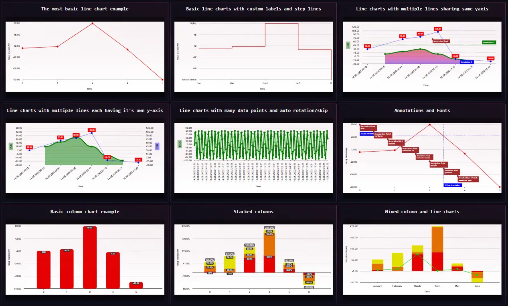

# PHP SVG Charts (Beta)
> Generate SVG image charts in PHP with ease.

[](https://github.com/brainfoolong/php-svg-charts/actions/workflows/tests.yml)



### Features

- Different types of charts ([suggest and help to integrate more](https://github.com/brainfoolong/php-svg-charts/issues))
- RAW SVG output
- PHP generation, no JS or Browser needed (Makes it easy to use cronjobs/automations)
- Extremely customizable in output, design and data representation. Even add custom attributes so you can write your own frontend JS code to provide mouseover tooltips for example

### Requirements
Basic PHP 8.1+ with no special extensions, runs everywhere where basic PHP can be installed.

### Installation
```
composer require brainfoolong/svg-charts
```

### Usage / Documentation

Just head to https://brainfoolong.github.io/php-svg-charts/